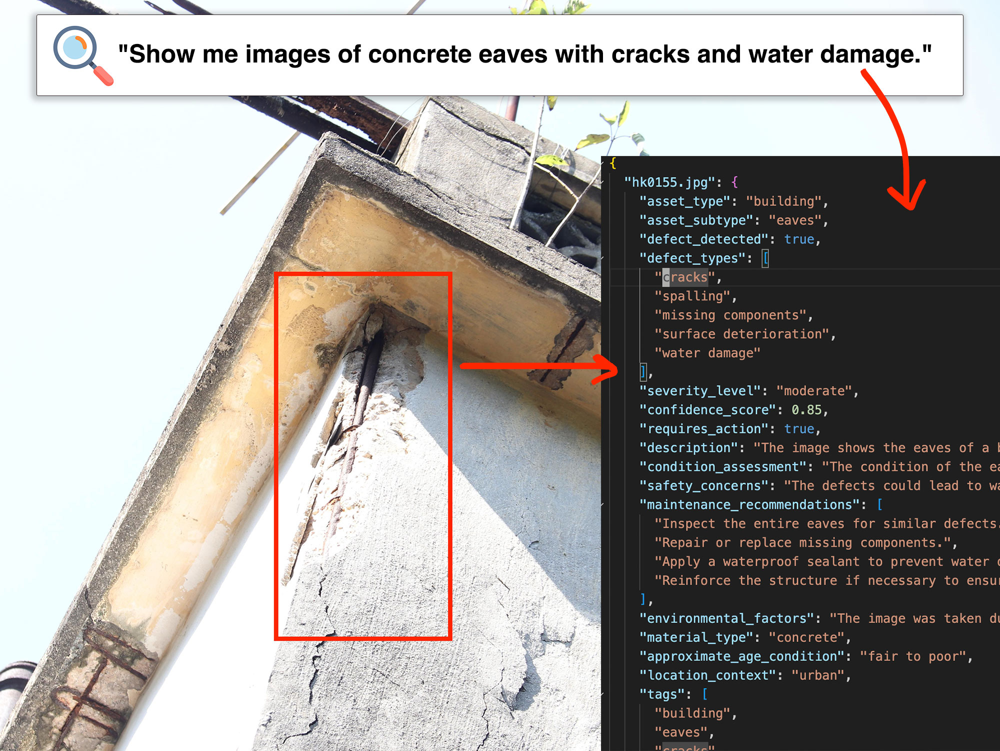
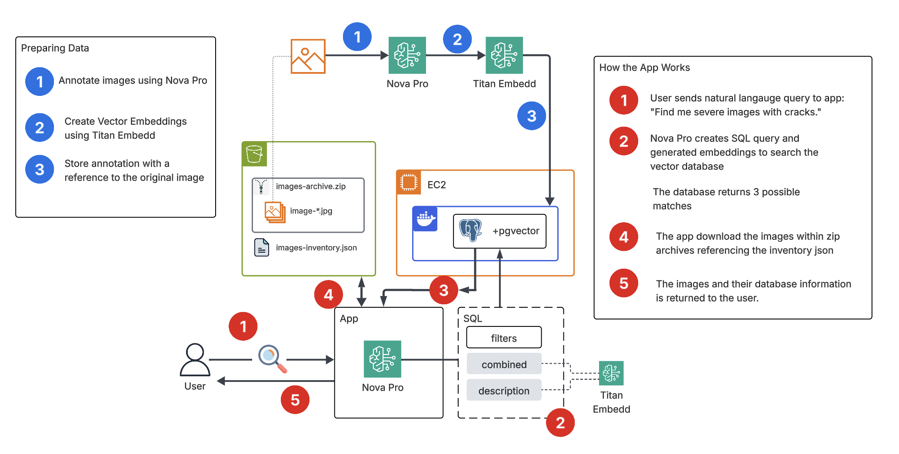

# AWS GenAI Storage Workshop

## Prerequisites 事前準備
- AWS Account
- GitHub Account

## Table of Contents 目次

- [Overview 概要](#overview)
- [Setup セットアップ](#setup)
- [Test S3 Range](#test-s3-range)
- [Prepare Dataset データセット準備](#prepare-dataset)
- [Prepare Vector Database](#prepare-vector-database)
- [Agent Search](#agent-search)

# Overview

## Business Use-Case

An engineering firm needs to audit and track public infrastructure for safety via drone arial footage. They have captured tens of thousands of images (eg. cracks in bridges) and have stored them within archives based on year and month.

As a Cloud Engineer you have been tasked to building a proof-of-concept where you can use GenAI to use natural language to retrieve an image from the archive.

You need to report back possible technical paths and technical considerations for this project.

エンジニアリング会社は、ドローンの空撮映像を通じて公共インフラの安全性を監査・追跡する必要があります。彼らは数万枚の画像（例：橋のひび割れ）を撮影し、年月別のアーカイブに保存しています。
クラウドエンジニアとして、あなたはGenAIを使用して自然言語でアーカイブから画像を検索できる概念実証を構築する任務を与えられました。
このプロジェクトの技術的な道筋と技術的考慮事項を報告する必要があります。



## Considertions and Requirements

- All resources will be created in `ap-northeast-1` Asia Pacific (Tokyo)
- We'll be using GitHub Codespaces so we have a consistent developer enviroment 
- We are not using free-tier services but the cost should be under $1 USD for the duration of the workshop
- We'll be using the following repo: [https://github.com/ExamProCo/aws-storage-genai-workshop](https://github.com/ExamProCo/aws-storage-genai-workshop)
- We may need to rebuild the container for AWS CLI to be installed


> devcontainers doesn't always work on Codespaces and requires lengthly rebuild and then even still hangs.

## Technical Uncertainty

- Can we extract specific bytes from an S3 file and read them?
- Can we use Amazon Nova to generate mock images to vary our dataset?
- Can we annotate the images in structure json output using Amazon Nova?
- Can we extract a specific image file from a zip archive from s3 (without the need to download archive)
- Can we use Nova Titans to create embeddings for our vector search database?
- Can we deploy pgvector database via container on a t3.micro?
- Can we get Amazon Nova to generate our query to our vector database and return the results?

---

- S3ファイルから特定のバイトを抽出して読み取ることはできますか？
- Amazon Novaを使用してデータセットを多様化するためのモック画像を生成することはできますか？
- Amazon Novaを使用して構造化されたJSON出力で画像に注釈を付けることはできますか？
- S3のzipアーカイブから特定の画像ファイルを抽出することはできますか（アーカイブをダウンロードする必要なく）？
- Nova Titansを使用してベクター検索データベース用の埋め込みを作成することはできますか？
- t3.microでコンテナ経由でpgvectorデータベースをデプロイすることはできますか？
- Amazon Novaにベクターデータベースへのクエリを生成させて結果を返すことはできますか？

## Technical Diagram




## Public Dataset

We are using the CUBIT Infrastructure Defect Detection Dataset

CUBIT インフラ欠陥検出データセットを使用しています

https://github.com/BenyunZhao/CUBIT

# Setup

## AWS Account Setup

### Enable All Amazon Bedrock Models

1. Drop down the region changer
2. Change your region your to `東京 ap-northeast-1`

</img>

1. In the search bar type `bedrock`
2. Click on Amazon Bedrock to go to this service.

</img>

1. In the left hand column click on `モデルアクセス`

</img>

1. Click on `すべてのモデルを有効にする`

</img>

1. Click on `次へ`

</img>


1. Click on `送信`

</img>

1. See that the models `Nova Pro`, `Nova Canvas` are enabled

</img>


### Setup AWS Infrastructure

- We need the two subnets from the default VPC.
- We need to run this command in CloudShell:

```sh
aws ec2 describe-subnets \
--region ap-northeast-1 \
--filters "Name=vpc-id,Values=$(aws ec2 describe-vpcs --region ap-northeast-1 --filters "Name=is-default,Values=true" --query 'Vpcs[0].VpcId' --output text)" --query 'Subnets[0:2].SubnetId' --output text | tr '\t' ','
```

1. Open CloudShell
2. Paste the AWS CLI command from above
3. Copy the Subnet IDS for the next step

</img>

Lets deploy the following AWS Infrastructure:
- AWS User with AWS Credentials
- S3 Bucket
- RDS Instance

Please click this button to deploy:

<a target="_blank" href="https://console.aws.amazon.com/cloudformation/home?region=ap-northeast-1#/stacks/create/review?templateURL=https://storage-genai-workshop.s3.ap-northeast-1.amazonaws.com/setup.yaml">

</a>

1. Write the name for the stack スタック名: `GenAIStorageStack`
2. Paste in the SubnetIds from the previous step
3. Set the database password `Testing123!`
4. Enable extra permissions
5. Create stack (and wait 5 mins)


</img>

1. Click on outputs
2. See the outputs, we will use them soon.


</img>


## Prepare GitHub CodeSpaces Environment

1. Click on `Code`
2. Click on `Codespaces`
3. Click on `Create codespace on main`

</img>

1. Create copy of `.env.example and name it `.env`
2. Update `AWS_ACCESS_KEY_ID`, `AWS_SECRET_ACCESS_KEY` and `AWS_BUCKET_NAME` (get the values from the Cloudformation Stack)

</img>


1. Install Ruby Libraries by running `bundle install`

```sh
cd /workspaces/aws-storage-genai-workshop 
bundle install
```

</img>

> To install nokogiri will takes 1-2 mins

1. Install AWS CLI

```sh
curl "https://awscli.amazonaws.com/awscli-exe-linux-x86_64.zip" -o "/tmp/awscliv2.zip" && \
cd /tmp && unzip awscliv2.zip && sudo ./aws/install && \
rm -rf awscliv2.zip aws/ && cd -
```

</img>

🎉  **Setup Complete セットアップ完了** 🎉 

# Test S3 Range

## Technical Uncertainty

We want to determine if we can read part of a file without downloading the entire file.
Amazon S3 suggests you can use a RANGE Http Header to specific the byte range to download.

### Upload File

We will upload a file called `hello_world.txt` to our bucket.

The contents of this file is `こんにちは世界`.

```bash
./bin/upload_file
```

### Read Part Of File

We will specfic the byte range to only read `世界`.

```bash
./bin/read_range
```

</img>

# Prepare Dataset

## Generate Mock Images

If our dataset has missing image examples we can generate our own to help later test
the edge cases for our application.

We are using `Amazon Nova Canvas` to generate images.

```sh
./bin/generate
```

This will output a file to `010__prepare_dataset/outputs/images/`

</img>

> Example of generated image using the following prompt: The image shows the eaves of a building with visible cracks, spalling, and missing components. The surface appears deteriorated, with signs of water damage and discoloration. The eaves are part of the building's exterior, and the defects are concentrated along the edge where the roof meets the wall.


## Annotate Images

We need to generate out annotation (metadata) information so we can search our iamgs.

We are using `Amazon Nova Pro` to to analyze the image.

The challenge is generated structured json output.
While this implementation of `./bin/annotate` works, there is a chance for 1,000 of runs it might fail and so more work need to put to catch edgecases.

```sh
./bin/annotate
```

Here is a example of annoation output: [annotate.json.example](./outputs/annotate.json.example)

> This will annotate our real images, not the mock ones. If we can to include the mock ones we need to copy them into the input directory

## Create Archive, Inventory File and Upload to S3

1. Zip our images to an archive
2. Read the zip file and create an inventory file with byte ranges for exact files
3. Upload the zip archive to our S3 bucket

```sh
./bin/upload
```

## Test Downloading Single Image from the Archive

This script will read the inventory file to get the byte range,
we will use the byte range to download the image from inside the archive.

We have to decompress the partial data to get to the final file.

```sh
./bin/download hk0155.jpg
```

## Create Embedding Data

We will use an embedding model to convert our annotation data int vector embeddings.
We'll generate out a SQL file to mass import our data into our database.

```sh
./bin/embedd
```

# Prepare Vector Database

## Install PSQL

In order to interact with our Postgres database we will need to install the postgres client

```sh
sudo apt update
sudo apt install postgresql-client -y
```

## Load Data into Databaase 

- We will enable vector extension
- We will setup our tables

```sh
./bin/execute ./sql/setup.sql
```

- We will insert our database

```sh
./bin/execute ./sql/insert.sql ⚠️⚠️⚠️⚠️ 生成されたファイルで実際のファイル名を確認してください。
```
> ⚠️ This file is autogenerated with a timestamp so you'll need to autocomplete eg. ./bin/execute ./sql/insert-1751397185.sql 

- Will will create our indexes

```sh
./bin/execute ./sql/indexes.sql
```

These warnings is due to our low amount of data.
In our production use-case we need to have indexes.

```sh
psql:sql/indexes.sql:9: NOTICE:  ivfflat index created with little data
DETAIL:  This will cause low recall.
HINT:  Drop the index until the table has more data.
CREATE INDEX
psql:sql/indexes.sql:11: NOTICE:  ivfflat index created with little data
DETAIL:  This will cause low recall.
HINT:  Drop the index until the table has more data.
CREATE INDEX
```

# Agent Search

## Agent

Using the converse API and Amazon Bedrock Pro we can search against
our vector database.

Example queries:
```sh
./bin/agent "cracks in wall that are not a concern"
./bin/agent "severe structural cracks in concrete walls"
./bin/agent "building defects requiring immediate action"
./bin/agent "roof problems with water damage"
./bin/agent "moderate spalling on urban structures"
./bin/agent "all safety concerns in buildings"
```
# Cleanup

- Empty S3 Bucket
- Delete Stack
